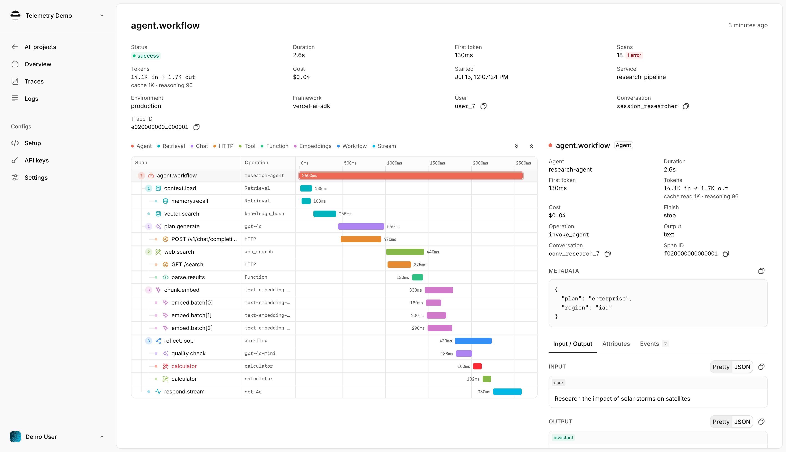

<div align="center">

# telemetry.dev

### See every AI call, tool run, token, and error in one trace.

Open-source observability for AI applications and agents. Trace model calls, inspect tool use, measure cost and latency, and find errors without changing providers.

[Start tracing](https://telemetry.dev) · [Read the docs](https://docs.telemetry.dev)

</div>



## Understand what your AI application does

A single request can call a model, run several tools, retry, and call the model again. telemetry.dev joins that work into one trace, so you can see the full path from input to output.

- **Trace complete agent runs.** See model calls, tool executions, retries, and errors in order.
- **Measure usage and cost.** Compare token use, latency, time to first token, and estimated cost.
- **Inspect safely.** Control input and output capture, mask sensitive values, and set content limits.
- **Use your current stack.** Send OpenTelemetry data or install an integration for your provider, framework, or coding agent.

## Start in minutes

Create a project at [telemetry.dev](https://telemetry.dev), copy an API key, and install the SDK.

```sh
npm install @telemetry-dev/sdk
```

```ts
import { init } from "@telemetry-dev/sdk";

const telemetry = init({
  apiKey: process.env.TELEMETRY_DEV_API_KEY,
});
```

The SDK sends traces through OTLP, the OpenTelemetry Protocol. You can also use the Python SDK or an OpenTelemetry exporter.

[Open the quickstart](https://docs.telemetry.dev/quickstart)

## Works with your AI stack

telemetry.dev has integrations for OpenAI, Anthropic, Google Gen AI, Amazon Bedrock, LiteLLM, the Vercel AI SDK, TanStack AI, Eve, opencode, Oh My Pi, and Pi.

[See all integrations](https://docs.telemetry.dev/integrations)

## Open source

This repository contains the documentation for telemetry.dev. The product source is available in the [telemetry.dev repository](https://github.com/telemetry-dev/telemetry).
